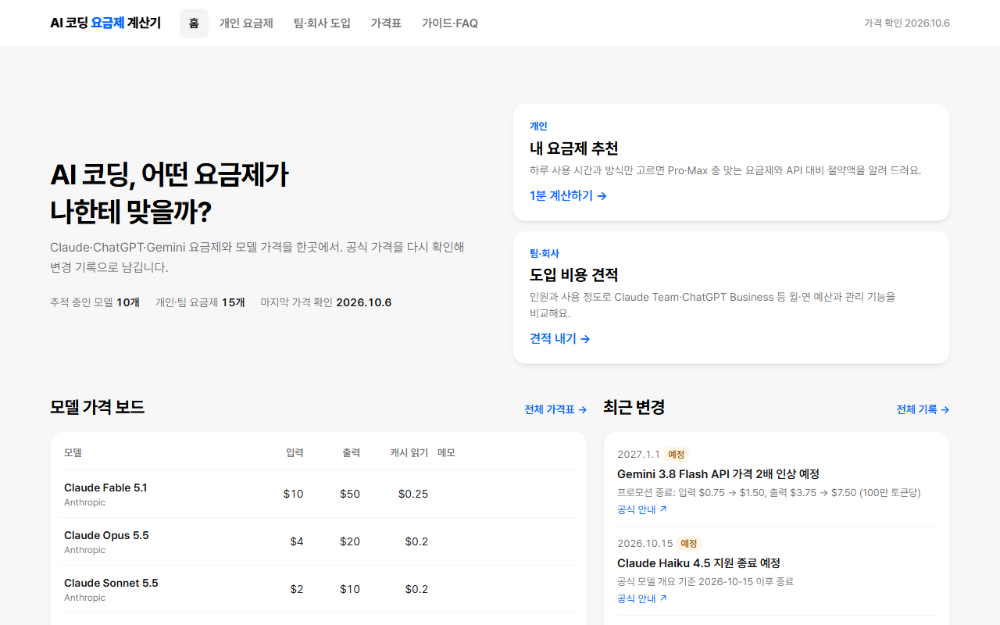

# AI 코딩 요금제 계산기

하루 몇 시간, 어떻게 쓰는지만 고르면 AI 코딩 구독 요금제(Pro, Max 5x, Max 20x 등)를 추천하고, 같은 양을 API로 쓰면 얼마인지 원화로 비교하는 정적 사이트.

**🔗 Live:** <https://hgko1207.github.io/ai-cost-calc/>



## 페이지

| 주소 | 내용 |
|---|---|
| `/` | 홈: 개인·팀 입구, 모델 가격 보드, 최근 변경 기록 |
| `/personal/` | 개인 요금제 추천: 추천 요금제와 다음 할 일, 요금제별 한도 대비 사용량, API 환산 (+ 토큰으로 직접 계산) |
| `/team/` | 팀·회사 도입 예산표: 좌석별 단가×인원, 도입 방식 비교, 관리 기능, 결재용 요약 |
| `/prices/` | 요금제·모델 가격표, 사용량 대비 가격, 변경 기록 |
| `/guide/` | 구독 vs API, 계산 방법, 회사 도입 가이드, FAQ |

## 실행

```bash
npm install
npm run dev       # http://localhost:4321 개발 서버
npm test          # 계산 로직 테스트 (vitest)
npm run build     # dist/ 생성 (가격 JSON 스키마 검증 포함)
npm run preview   # 빌드 결과 미리보기
npm run usage     # 내 Claude Code 로그에서 토큰 사용량 집계 (숫자만)
```

- 스택: Astro 7 + Preact. 계산기만 아일랜드, 나머지는 정적 HTML. 서버 없이 `dist/`를 정적 호스팅에 올리면 됩니다.
- 디자인: 원티드 디자인 시스템(Montage) 토큰
- 방문 측정: GoatCounter(쿠키 없음)

## 운영 문서

가격 갱신 절차, 월간 가격 점검, URL 파라미터, 블로그 삽입 코드, 배포·호스팅 이전, 방문 측정은 [docs/maintaining.md](docs/maintaining.md)에 있습니다. 블로그에 넣는 코드만 보려면 [docs/embed.md](docs/embed.md).
